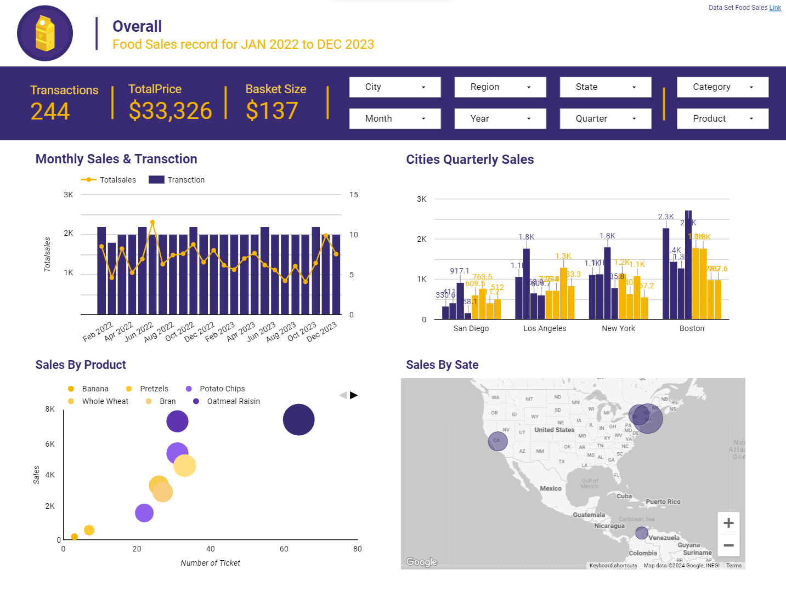

# Dashboard

I've been learning myself how to build dashboards like Power BI, Looker Studio, and Tableau. I even made a mini-project dashboard to practice! 🍀🍀

(While I might still be learning, I'm always working on improving my skills. I'm excited to keep creating more projects!✌️✨)

### Mini Project:
[Dashboard - Food Sales](https://lookerstudio.google.com/reporting/2d8f7dbd-fe71-4477-b8fd-b65862e49f52)

